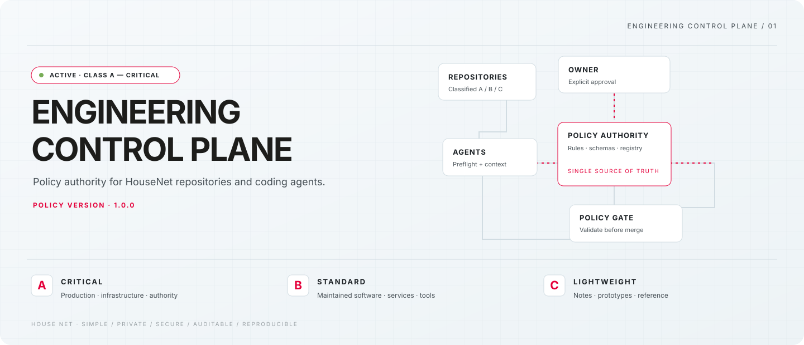
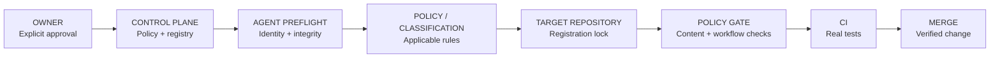

## English

  <picture>
    <source media="(prefers-color-scheme: dark)" srcset="assets/control-plane-hero-dark.svg">
    <source media="(prefers-color-scheme: light)" srcset="assets/control-plane-hero-light.svg">
    
  </picture>

<strong>HOUSE NET · ENGINEERING CONTROL PLANE</strong> Canonical policy, classification and agent authority for HouseNet engineering.

  
  <a href="https://github.com/HouseNet-Projects/house-net-control-plane/blob/main/docs/POLICY.md">Policy authority</a>
  <a href="https://github.com/HouseNet-Projects/house-net-control-plane/blob/main/docs/ENFORCEMENT.md">Enforcement map</a>

## Control plane status

<!-- housenet-generated: control-plane-status:start -->
| Surface | Current state |
| :--- | :--- |
| **CONTROL PLANE** | **ACTIVE** · CI **GREEN** |
| **POLICY** | `1.4.1` · machine authority under [`policy/`](policy/) |
| **CLASSIFICATION** | **CLASS A — CRITICAL** |
| **AUTHORITY** | `HouseNet-Projects` · explicit owner approval |
| **CANONICAL REPOSITORIES** | `3` registered · visibility **PUBLIC** |
| **EXECUTION BOOTSTRAP** | **ENFORCED** · global map + deterministic preflight |
| **LOCAL EXECUTION ENFORCEMENT** | **PENDING** · No secondary local execution client is installed in this WSL |
| **GITHUB BRANCH PROTECTION** | **ENFORCED** · protected `main`, required CI checks |
<!-- housenet-generated: control-plane-status:end -->

This repository is the engineering command center: it records the current rules, registers approved repositories, supplies agent maps, and runs the checks that can be made deterministic. It keeps owner approval explicit while enforcing the controls available on the public canonical repositories.

## Authority and agent bootstrap

The execution client loads a short global map, resolves this control plane, reads the current manifest and authority rules, then runs `bin/housenet-preflight --json`. Future repositories receive only a small agent instruction adapters, and `house-net-control.json`; the full policy remains here.

## Enforcement matrix

| Layer | State | What it means |
| :--- | :---: | :--- |
| Execution-client instruction map | **ENFORCED** | Fresh sessions are directed to current control-plane truth |
| Local preflight | **ENFORCED** | Identity, remote, policy integrity, registry, Git baseline and remote freshness |
| Control-plane CI | **ENFORCED** | Schemas, rule ownership, source coverage, templates, syntax and tests |
| Reusable policy gate | **ENFORCED** | Future approved callers can pin the trusted composite gate by commit SHA |
| Local execution hooks | **PENDING** | No provider-specific local client installation exists in this WSL |
| GitHub branch protection | **ENFORCED** | Public canonical repositories use protected `main` branches and required CI checks |

Read the precise boundaries in [`docs/ENFORCEMENT.md`](docs/ENFORCEMENT.md).

## Repository classes

| Class | Meaning | Visual signal | Minimum posture |
| :---: | :--- | :---: | :--- |
| **A** | Critical production, customer, billing, identity, infrastructure or control systems | <strong>CRITICAL</strong> | Strongest practical controls, meaningful CI, explicit deployment and recovery design |
| **B** | Maintained software, services, APIs, integrations and automation | <strong>STANDARD</strong> | Useful tests, clean PR flow, proportional protection |
| **C** | Documentation, prototypes, low-risk utilities and approved reference material | <strong>LIGHTWEIGHT</strong> | Clear purpose, clean history, no decorative governance |

Every future repository must be proposed and classified before creation. The registry lists every certified HouseNet repository and its applicable controls.

## Machine authority

| Domain | Source |
| :--- | :--- |
| Ownership, approval and scope | [`policy/authority.json`](policy/authority.json) |
| A/B/C classification | [`policy/repository-classes.json`](policy/repository-classes.json) |
| Repository foundation and lifecycle | [`policy/repository-baseline.json`](policy/repository-baseline.json) |
| Migration intake and adoption | [`docs/MIGRATION-LIFECYCLE.md`](docs/MIGRATION-LIFECYCLE.md) · `bin/housenet-import` |
| Git and merge behavior | [`policy/git.json`](policy/git.json) · [`policy/merge.json`](policy/merge.json) |
| Actions and CI | [`policy/actions.json`](policy/actions.json) |
| Dependency security | [`policy/security.json`](policy/security.json) |
| High-signal notifications | [`policy/notifications.json`](policy/notifications.json) |
| Version, provenance and coverage | [`policy/manifest.json`](policy/manifest.json) |

[`docs/POLICY.md`](docs/POLICY.md) is the human-readable view generated from machine policy. [`docs/source/HouseNet-GitHub-Policy-v1.0.md`](docs/source/HouseNet-GitHub-Policy-v1.0.md) is immutable provenance. The local HouseNet brand source and tokens live in [`assets/brand/`](assets/brand/).

## Quick navigation

| Need | Start here |
| :--- | :--- |
| Understand the system | [`docs/ARCHITECTURE.md`](docs/ARCHITECTURE.md) |
| Know what is actually enforced | [`docs/ENFORCEMENT.md`](docs/ENFORCEMENT.md) |
| Configure an agent | [`docs/AGENT-BOOTSTRAP.md`](docs/AGENT-BOOTSTRAP.md) |
| Propose or classify a repository | [`docs/REPOSITORY-LIFECYCLE.md`](docs/REPOSITORY-LIFECYCLE.md) |
| Run the local gate | `bin/housenet-preflight --json` |
| Run policy tests | `PYTHONDONTWRITEBYTECODE=1 python3 -m unittest discover -s tests -v` |

## Brand system

The visual system uses the preserved HouseNet logo files served by the official website and first-party colors documented in [`assets/brand/BRAND.md`](assets/brand/BRAND.md). The palette is intentionally restrained: HouseNet red for authority and critical emphasis, charcoal for control surfaces, cool gray for structure, and the observed green for active/success state. No external image host is required.

## Lifecycle

`PROPOSE → CLASSIFY → OWNER OK → CREATE → BOOTSTRAP → VALIDATE → OPERATE → RECLASSIFY / ARCHIVE`

Meaningful changes use `branch → change → test → PR → green CI → merge`. No production deployment, automatic dependency merge, repository creation, reclassification, archive, or destructive operation is implied by this repository.

## Maintainer note

HouseNet-Projects owns this public control plane. The goal is the minimum correct configuration for the actual risk: simple, secure, auditable, reproducible and intentional.

---

## Հայերեն

<strong>HOUSE NET · ԻՆԺԵՆԵՐԱԿԱՆ ԿԱՌԱՎԱՐՄԱՆ ՀԱՐԹԱԿ</strong> HouseNet-ի ինժեներական քաղաքականության, պահոցների դասակարգման, հաստատումների և գործակալների կանոնական կենտրոնը։

### Կառավարման հարթակի կարգավիճակ

<!-- housenet-generated: control-plane-status-hy:start -->
| Մակերես | Ընթացիկ վիճակ |
| :--- | :--- |
| Կառավարման հարթակ | **ԱԿՏԻՎ** · CI **ԿԱՆԱՉ** |
| Քաղաքականություն | `1.4.1` |
| Դասակարգում | **CLASS A — CRITICAL** |
| Իրավասու սեփականատեր | `HouseNet-Projects` |
| Կանոնական պահոցներ | `3` գրանցված · տեսանելիությունը՝ **PUBLIC** |
| Execution bootstrap | **ԿԻՐԱՐԿՎԱԾ** |
| Local execution enforcement | **ՍՊԱՍՄԱՆ ՄԵՋ** — երկրորդ local execution client տեղադրված չէ |
| GitHub branch protection | **ԿԻՐԱՐԿՎԱԾ** · `main`-ը պաշտպանված է, CI ստուգումները պարտադիր են |
<!-- housenet-generated: control-plane-status-hy:end -->

### Իշխանություն, գործակալներ և enforcement

Միայն `HouseNet-Projects`-ն է իրավասու։ Execution client-ը նախ ստուգում է ինքնությունը, կարդում է ընթացիկ control plane-ը և գործարկում է preflight-ը։ local execution client-ի enforcement-ը սպասման մեջ է, քանի որ այս WSL-ում երկրորդ local execution client չկա։ CI-ն ստուգում է սխեմաները, կանոնների ծածկույթը, դասակարգումը, բովանդակությունը, workflow-ները և երկլեզու պայմանագիրը։

### Դասակարգում և մեքենայական հեղինակություն

Class A-ը կրիտիկական համակարգերի համար է, Class B-ը՝ սովորական պահպանվող ծրագրերի, Class C-ը՝ թեթև և ցածր ռիսկի նախագծերի։ Մեքենայական կանոնները գտնվում են `policy/`-ում, սխեմաները՝ `schemas/`-ում, իսկ ռեեստրը՝ `registry/`-ում։ Մարդկանց համար նախատեսված բոլոր նյութերը ունեն ամբողջական English և Հայերեն բաժիններ։

### Արագ նավիգացիա

Enforcement՝ [`docs/ENFORCEMENT.md`](docs/ENFORCEMENT.md) · lifecycle՝ [`docs/REPOSITORY-LIFECYCLE.md`](docs/REPOSITORY-LIFECYCLE.md) · բրենդային աղբյուր՝ [`assets/brand/BRAND.md`](assets/brand/BRAND.md) · քաղաքականության մեքենայական հեղինակություն՝ [`policy/`](policy/)
